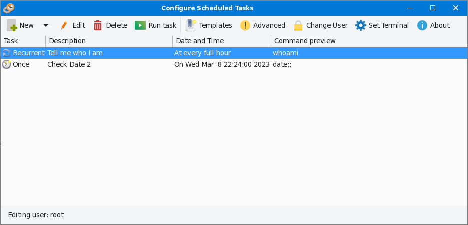

# gTock: the fork of GNOME Task Scheduler

This is the fork of GNOME Schedule for managing crontabs and at tasks with some overhaul and improvements

It was ported to GTK+3 (GTK4 experimental) and Python 3.x

## Installation (for now; requires root access)
* Just run install.sh script

## Alternative installation option
* Use meson (experimental)

## Known issues:
* GTK4 mode will not work for now due to conversion of problem of Glade file to GTK4

## How to enable experimental GTK4:
* Open /usr/share/gtock/config.py with a text editor
* Set gtk_version variable (at line 24) to "4.0" and save it
* Convert the glade file /usr/share/gtock/assets/gtock-gtk3.glade into GTK4 version and save it as /usr/share/gtock/assets/gtock-gtk4.glade
